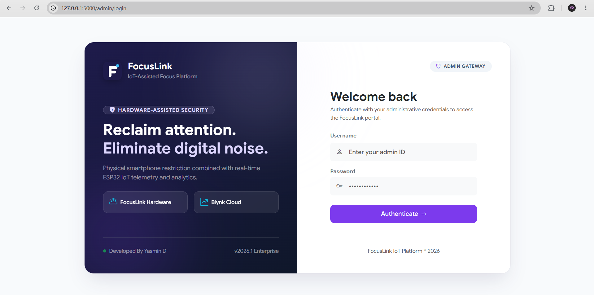
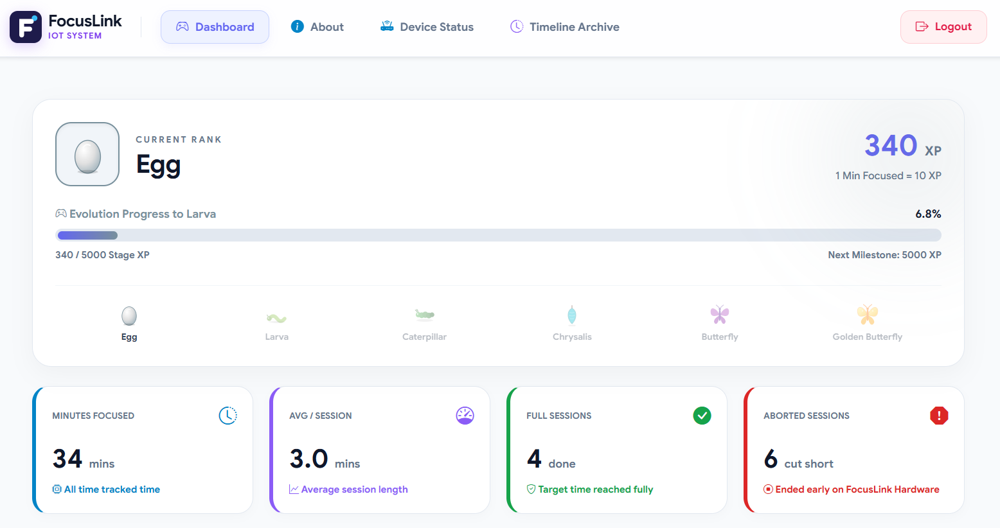
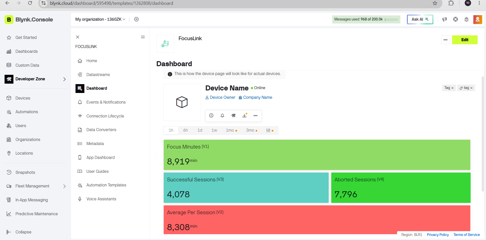
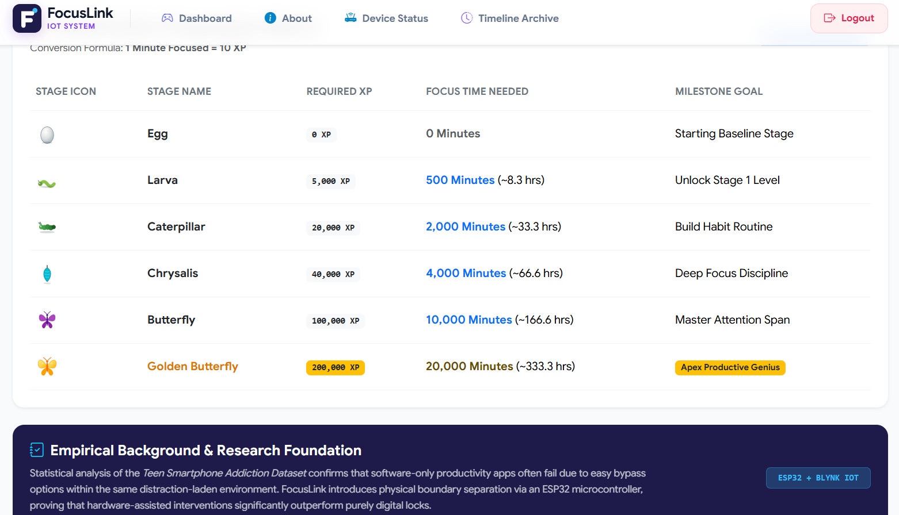
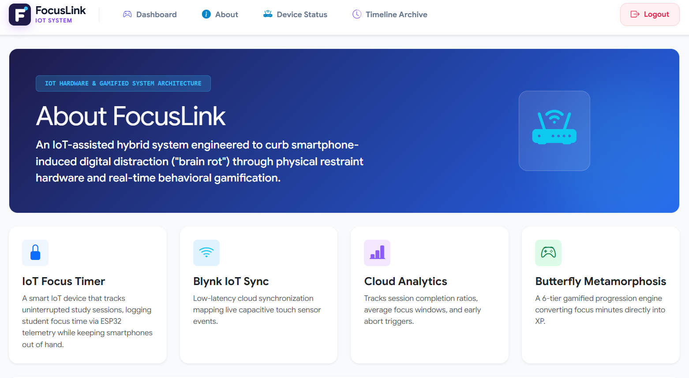
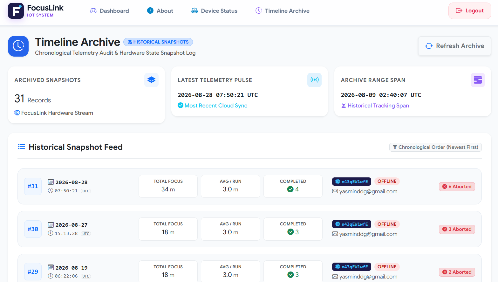

# 🦋 FocusLink V2 - Cloud-Native IoT Platform for Intelligent Focus Management

**An IoT-assisted hardware and cloud platform that physically separates you from your smartphone while digitally tracking, analyzing, and gamifying your focus time.**


---

## 🔗 Live Demo

**Live Demo:** (https://youtu.be/aOcFViRBoA8)

---

## 📖 Overview

FocusLink tackles smartphone-induced digital distraction with a **physical IoT-based intervention** instead of relying only on software restrictions that are easy to bypass. It pairs an **ESP32-powered hardware device** with a **cloud-connected web dashboard**, turning your uninterrupted focus time into XP through a six-stage **metamorphosis progression system** from 🥚 Egg all the way to 🦋 Golden Butterfly.

> *"Physically separate the distraction from the user while digitally tracking and rewarding focused time."*

## ❗ The Problem

- Smartphones remain physically accessible even with app/site blockers.
- Digital restrictions can often be bypassed.
- Notifications and distractions stay in the same environment as the user.
- Productivity apps rely heavily on self-discipline.

## ✅ The Solution

FocusLink introduces a **physical touch-based device** that starts, pauses, resumes, and aborts focus sessions while streaming live telemetry to the cloud for analytics and gamified rewards.

---

## ✨ Features

- 🖐️ **Touch-based interaction** - hold to select session duration, tap to pause/resume, long-press to abort
- ⏱️ **Configurable focus sessions** - 5 to 120 minutes (default: 30 minutes)
- 📟 **LCD local feedback** - real-time status and instructions on-device
- ☁️ **Blynk IoT Cloud integration** - live telemetry sync over Wi-Fi
- 📊 **Web dashboard** - real-time metrics, analytics, and device status
- 🕰️ **Timeline archive** - chronological historical session snapshots
- 🎮 **XP-based gamification** - 1 minute focused = 10 XP
- 🦋 **6-stage metamorphosis progression** - Egg → Larva → Caterpillar → Chrysalis → Butterfly → Golden Butterfly

---

## 🏗️ System Architecture

```
USER
 ↓
Focus Session Selection
 ↓
FOCUSLINK ESP32
 ├── Touch Sensor
 ├── LCD Display
 └── Focus Timer
 ↓
Wi-Fi
 ↓
BLYNK CLOUD
 ↓
TELEMETRY / DATASTREAMS
 ↓
FOCUSLINK WEB PLATFORM
 ├── Dashboard
 ├── Device Status
 ├── Analytics
 └── Timeline Archive
 ↓
XP / GAMIFICATION
 ↓
METAMORPHOSIS PROGRESSION
```

---

## 🔧 Hardware & Circuit Connections

**Components:** ESP32 development board · I2C LCD display · Capacitive touch sensor · Breadboard + jumper wires

| Component     | Pin  | ESP32 Connection |
|----------------|------|-------------------|
| Display        | VCC  | 3V3               |
| Display        | GND  | GND               |
| Display        | SDA  | D21               |
| Display        | SCL  | D23               |
| Touch Sensor   | VCC  | 3V3               |
| Touch Sensor   | GND  | GND               |
| Touch Sensor   | I/O  | D15               |

**User Interaction:**
- Hold **1 second** → select/confirm session duration
- **Touch** → pause/resume active session
- Hold **5 seconds** → abort current session

---

## ☁️ Blynk Cloud Integration

FocusLink uses **Blynk IoT Cloud** as the synchronization layer between the ESP32 hardware and the web dashboard, using the following virtual datastreams:

| Pin | Name                 | Type    | Range     | Unit |
|-----|----------------------|---------|-----------|------|
| V1  | minutesFocus         | Integer | 0–10000   | min  |
| V2  | averagePerSession    | Integer | 0–10000   | min  |
| V3  | successfulSessions   | Integer | 0–10000   | —    |
| V4  | abortedSessions      | Integer | 0–10000   | —    |

---

## 🎮 Gamification - XP & Metamorphosis

**Conversion formula:** `1 minute focused = 10 XP`

| Stage           | Required XP | Focus Time Needed        | Milestone Goal          |
|------------------|-------------|---------------------------|--------------------------|
| 🥚 Egg           | 0 XP        | 0 minutes                 | Starting Baseline Stage  |
| 🐛 Larva         | 5,000 XP    | 500 min (~8.3 hrs)         | Unlock Stage 1 Level     |
| 🐛 Caterpillar   | 20,000 XP   | 2,000 min (~33.3 hrs)      | Build Habit Routine      |
| 🦋 Chrysalis     | 40,000 XP   | 4,000 min (~66.6 hrs)      | Deep Focus Discipline    |
| 🦋 Butterfly     | 100,000 XP  | 10,000 min (~166.6 hrs)    | Master Attention Span    |
| 🌟 Golden Butterfly | 200,000 XP | 20,000 min (~333.3 hrs) | Apex Productive Genius   |

---

## 🖥️ Tech Stack

| Layer          | Technology                          |
|----------------|---------------------------------------|
| Microcontroller | ESP32                                |
| Connectivity    | Wi-Fi                                |
| IoT Cloud       | Blynk IoT Platform                   |
| Web Dashboard   | FocusLink Web Platform (dashboard, device status, analytics, timeline archive) |

---

## 📸 Screenshots

| Login Page | Dashboard | Blynk Cloud Console |
|------------|-----------|-----------------------|
|  |  |  |

| Metamorphosis Progression | Device Status | Timeline Archive |
|----------------------------|----------------|---------------------|
|  |  |  |

---

## 🚀 Getting Started

```bash
# Clone the repository
git clone https://github.com/yasmin1714/FocusLink-V2--Cloud-Native-IoT-Platform-for-Intelligent-Focus-Management.git

# Navigate into the project
cd FocusLink-V2--Cloud-Native-IoT-Platform-for-Intelligent-Focus-Management

```

---

## 🔮 Future Scope

- Advanced focus analytics
- Personalized focus recommendations
- Additional sensing capabilities
- Mobile notifications
- Expanded cloud analytics
- Multi-user support
- Machine-learning-based focus pattern analysis

---

## 👩‍💻 Author

**Developed by Yasmin D**

---

## 📄 License

This project is licensed under the MIT License.
